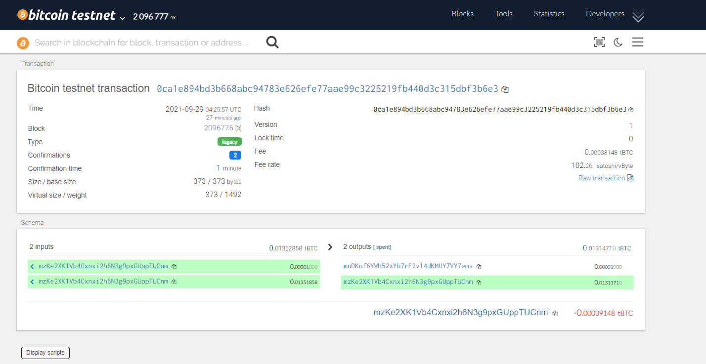
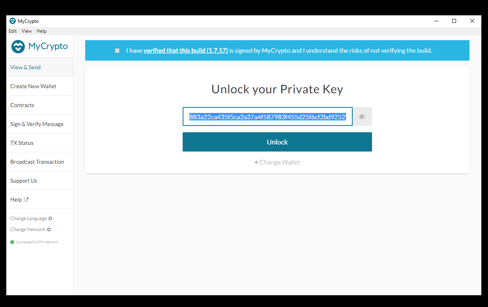
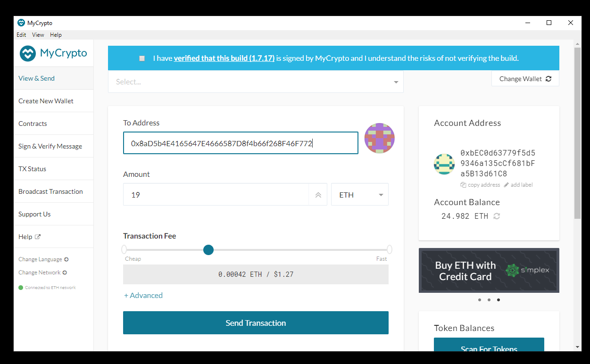

# Unit 19: Multi Blockchain Wallet in Python by John Mangahas

## Dependencies
----

The following dependencies are required for this assignment;

1. HD Wallet Derive
2. `bit` Python Bitcoin Library
2. `web3.py` Python Ethereum Library

## Project Setup
----

1. Create a project directory called `unit19` and `cd` into it using gitbash (Run as Administrator).

2. Clone the `hd-wallet-derive` tool into this folder 


3. Establish a symlink called derive for the `hd-wallet-derive/hd-wallet-derive.php`. This will clean up the command needed to run the script in our code, as we can call ./derive instead of ./hd-wallet-derive/hd-wallet-derive.php.


4. Make sure you are in the top level project directory - in this case the directory named `unit19`.

5. Run the command `export MSYS=winsymlinks:nativestrict`.

6. Run the following command: `ln -s hd-wallet-derive/hd-wallet-derive.php derive`.

7. Test the `./derive` script, by running the following command:

`php hd-wallet-derive.php -g --mnemonic="mnemonic phrase of your test wallet" --cols=path,address,privkey,pubkey`

8. The output will be several address with corresponding privkey and pubkey


## Directory struture

* Disclaimer: I am not able to upload the hd-wallet-derive on github but your directory should look like this.


## Constants
______

1. In a separate file, [constants.py](unit19/constants.py), set the following constants:

`BTC = 'btc'`
`ETH = 'eth'`
`BTCTEST = 'btc-test'`

2. In wallet.py, import all constants: from constants import *

3. Use these anytime you reference these strings, both in function calls, and in setting object keys.

## Generate a Mnemonic phrase

1. Generate a new 12 word mnemonic using hd-wallet-derive or by [using this tool](tools/bip39-standalone.html).

2. Set this mnemonic as an environment variable by storing it a an .env file and importing it into your [wallet.ipynb](unit19/wallet.ipynb).

## Derive the wallet Keys

1. Create a function called derive_wallets that does the following:


2. Use the subprocess library to create a shell command that calls the ./derive script from Python. Make sure to properly wait for the process. Windows Users may need to prepend the php command in front of ./derive like so: php ./derive.


3. The following flags must be passed into the shell command as variables:

   * `Mnemonic (--mnemonic) must be set from an environment variable, or default to a test mnemonic`
   * ` Coin (--coin)`
    * `Numderive (--numderive) to set number of child keys generated`
    * `Format (--format=json) to parse the output into a JSON object using json.loads(output)`

4. Create a dictionary object called `coins` that uses the derive_wallets function to derive `ETH` and `BTCTEST` wallets.

5. When done properly, the final output will look similar to this with each coin generating three accounts:


## Linking the transaction signing libraries to

1. Use bit and web3.py to leverage the keys stored in the coins object by creating three more functions:


* priv_key_to_account:
    * This function will convert the privkey string in a child key to an account object that bit or web3.py can use to transact.

* This function needs the following parameters:
    * coin -- the coin type (defined in constants.py).
    
    * priv_key -- the privkey string will be passed through here.

* You will need to check the coin type, then return one of the following functions based on the library:
    * For ETH, return Account.privateKeyToAccount(priv_key)
        * This function returns an account object from the private key string. You can read more about this object here.
    * For BTCTEST, return PrivateKeyTestnet(priv_key)
        * This is a function from the bit libarary that converts the private key string into a WIF (Wallet Import Format) object. WIF is a special format bitcoin uses to designate the types of keys it generates.
        * You can read more about this function here.

* create_tx:

    * This function will create the raw, unsigned transaction that contains all metadata needed to transact.
    * This function needs the following parameters:
       * coin -- the coin type (defined in constants.py.)

       * account -- the account object from priv_key_to_account.

       * to -- the recipient address.

       * amount -- the amount of the coin to send.


* You will need to check the coin type, then return one of the following functions based on the library:

    * For ETH, return an object containing to, from, value, gas, gasPrice, nonce, and chainID.Make sure to calculate all of these values properly using web3.
    * For BTCTEST, return PrivateKeyTestnet.prepare_transaction(account.address, [(to, amount, BTC)])

* send_tx:


    * This function will call create_tx, sign the transaction, then send it to the designated network.

    * This function needs the following parameters:

      *  coin -- the coin type (defined in constants.py).

      *  account -- the account object from priv_key_to_account.

      *  to -- the recipient address.

      *  amount -- the amount of the coin to send.


    * You may notice these are the exact same parameters as create_tx. send_tx will call create_tx, so it needs all of this information available.


    * You will need to check the coin, then create a raw_tx object by calling create_tx. Then, you will need to sign the raw_tx using bit or web3.py (hint: the account objects have a sign transaction function within).

    * Once you've signed the transaction, you will need to send it to the designated blockchain network.

        * For ETH, return w3.eth.sendRawTransaction(signed.rawTransaction)

        * For BTCTEST, return NetworkAPI.broadcast_tx_testnet(signed)

## Sending Transactions

1. Make sure to fund the wallets using testnet faucets

    BTC-TEST

    * https://testnet-faucet.mempool.co
    * https://coinfaucet.eu/btc-testnet
    * https://tbtc.bitaps.com
    * http://kuttler.eu/bitcoin/btc/faucet/
    * http://bitcoinfaucet.uo1.net/

    ETH

    * https://faucet.ropsten.be

2. Open up a new gitbash terminal window inside of `unit19`.

3. Run the command `python` to open the Python shell

4. Within the Python shell, run the command `from unit19 import *` This will allow you to access the functions inside wallet.py. 

5. You will need to set the account with the `priv_ket_to_account` and use `send_tx` to send transactions.

    * Make sure to fund a BTCTEST address 

    * Use a block explorer to watch trasncations on the address

    * Send a transcation to another testnet address

    

    !

6. Local PoA Ethereum transaction

    * Add one of the `ETH` addresses to the pre-allocated accounts in your `networkname.json`

    * Delete the geth folder in each node, then re-initialize using geth --datadir nodeX init networkname.json. This will create a new chain, and will pre-fund the new account. Note: If this does not work for your operating system you can also setup a virtual environment with Ganache with the rpc server set to `HTTP://127.0.0.1:8545`.

    * Add the following middleware to web3.py to support the PoA algorithm:
    ```
    from web3.middleware import geth_poa_middleware

    w3.middleware_onion.inject(geth_poa_middleware, layer=0)
    ```

    * Due to a bug in web3.py, you will need to send a transaction or two with MyCrypto first, since the w3.eth.generateGasPrice() function does not work with an empty chain. You can use one of the ETH address privkey, or one of the node keystore files

    !

    !

    !

    * Send a transaction from the pre-funded address within the wallet to another, then copy the txid into MyCrypto's TX Status, and screenshot the successful transaction like so:

    !

    !

    !

    !
    
    